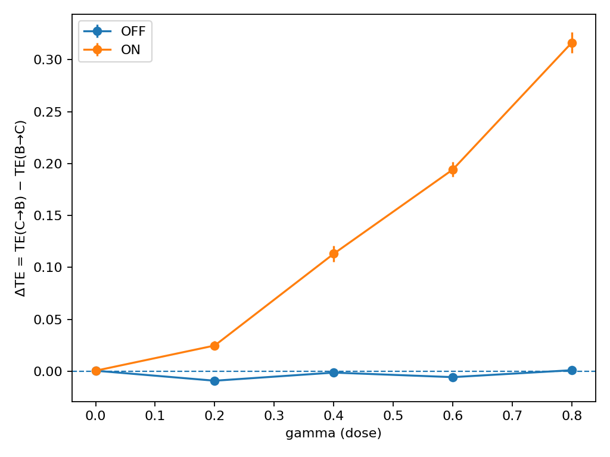
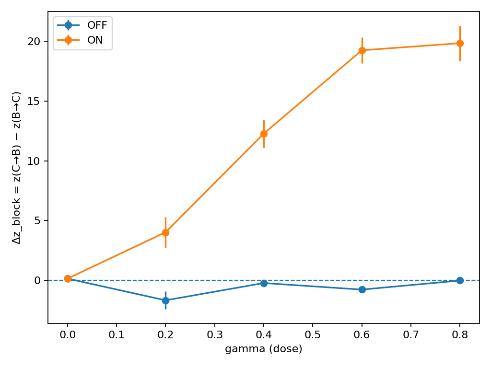
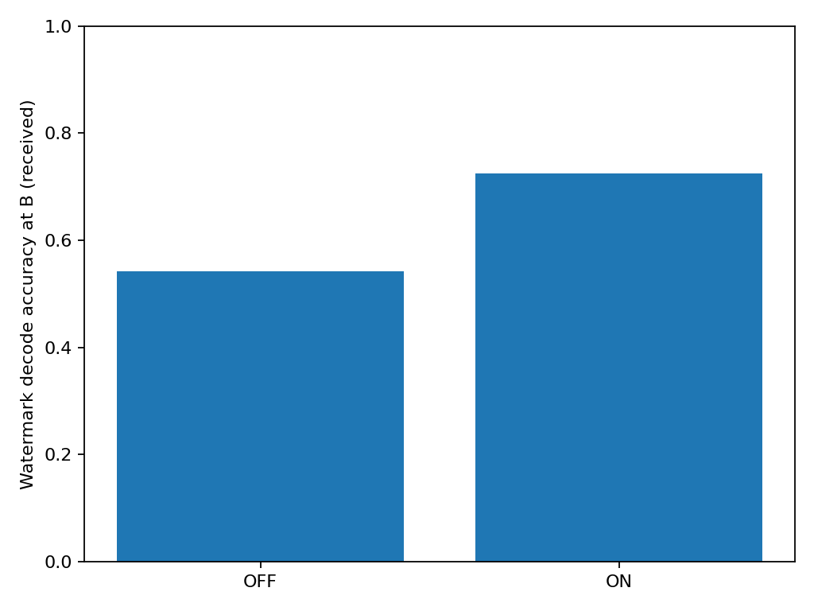

# CNull — a sanity check for emergent communication

**TL;DR**: CNull is a lightweight, intervention-based test that tells you whether coordinated behavior between agents is **real information flow** or just **pretty synchronization**. It adds an **ON/OFF intervention**, a **directional metric** (ΔTE), and **null controls**, then emits plots + a machine-checkable `verdict.json` you can gate in CI.

---

## Why this matters

Classic “emergence” metrics can light up on *self‑organization* (shared prompts, global drivers, common clocks). That’s risky: you might ship an impressive demo that’s actually an illusion. CNull adds a minimal experimental design to separate **causal, directional influence** from **synchrony artifacts**.

**Use cases**
- Multi‑agent LLM systems & agent frameworks (prove agents truly influence each other).
- Evals/MLOps pipelines (add a *gated* sanity check before release).
- Swarm/robotics & simulation labs (verify leader→swarm flow; avoid global-driver confounds).

---

## How it works (4 steps)

1. **Intervene (ON/OFF + dose γ)** — toggle the channel and vary its strength.  
2. **Measure direction** — compute **ΔTE = TE(C→B) − TE(B→C)**.  
3. **Defeat illusions** — compare against **block** and **circular** nulls to remove spurious synchrony.  
4. **Verdict** — export plots + `verdict.json` (`passes: true/false`) for CI gating.

> CNull differs from ordinary correlation-based “emergence” checks by combining **intervention**, **directionality**, and **null controls** in one short experiment.

---

## Quickstart

> Requires Python ≥3.10. On macOS you can limit threads for consistent timing.

```bash
python3 -m venv .venv && source .venv/bin/activate
pip install --upgrade pip setuptools wheel
pip install -e .

# (optional macOS perf tweak)
export OMP_NUM_THREADS=4 VECLIB_MAXIMUM_THREADS=4

# Run the positive control (ON/OFF + dose gamma)
cnull v3 --seeds 6 --cycles 300 --surrogates 80 \
  --gammas 0.0,0.2,0.4,0.6,0.8,1.0 --lags 3 --null_block 25 \
  --out v3_posctrl

# Make plots + machine verdict
cnull figs v3_posctrl
```

Outputs:
- `fig_dTE_vs_gamma.png` — dose‑response of directional influence (ON vs OFF).  
- `fig_dZblock_vs_gamma.png` — z‑score vs block‑null (ON ≫ OFF).  
- `fig_watermark_acc.png` — practical decode accuracy at the receiver (ON vs OFF).  
- `verdict.json` — pass/fail & summary statistics.

---

## Positive control — expected shape

Place the figures in `docs/` (or embed your own paths):

<p align="center">
  
  
</p>

<p align="center">
  
</p>

Example `verdict.json` (truncated):
```json
{
  "delta_z_block_ON_mean": 27.25,
  "delta_z_block_OFF_mean": 0.18,
  "passes": true
}
```

Interpretation:
- With channel **ON**, ΔTE and Δz_block increase with γ (dose response).  
- With **OFF**, both stay near zero.  
- Watermark accuracy at the receiver is higher **ON** than **OFF**.  
Together this distinguishes **genuine information flow** from **self‑organization**.

---

## CI gate (GitHub Actions)

Add a tiny workflow to fail builds unless the sanity check passes.

```yaml
# .github/workflows/cnull-posctrl.yml
name: CNull PosCtrl
on: [push, pull_request]
jobs:
  posctrl:
    runs-on: ubuntu-latest
    steps:
      - uses: actions/checkout@v4
      - uses: actions/setup-python@v5
        with: { python-version: '3.11' }
      - run: pip install -e .
      - run: |
          cnull v3 --seeds 6 --cycles 300 --surrogates 80 \
            --gammas 0.0,0.2,0.4,0.6,0.8,1.0 --lags 3 --null_block 25 \
            --out v3_posctrl_ci
          cnull figs v3_posctrl_ci
      - name: Check verdict
        run: |
          python - <<'PY'
          import json, sys, pathlib
          v = json.loads(pathlib.Path('v3_posctrl_ci/verdict.json').read_text())
          assert v.get('passes', False), f"FAIL: verdict {v}"
          print("PASS:", v)
          PY
```

---

## Python API (optional)

```python
from cnull.api import run_v3, make_figs  # names may change; see package

res_dir = run_v3(
    seeds=6, cycles=300, surrogates=80,
    gammas=[0.0,0.2,0.4,0.6,0.8,1.0],
    lags=3, null_block=25, out="v3_posctrl_api"
)
make_figs(res_dir)
verdict = json.load(open(f"{res_dir}/verdict.json"))
print("PASS:", verdict["passes"])
```

---

## Troubleshooting

- **`passes: false` but plots look good** — increase run strength to tighten nulls / lengthen series:
  - `--cycles 400–500`, `--surrogates 100–120`, optionally `--null_block 35`.
  - Ensure monotonic ΔTE for ON and OFF≈0.
- **Editable install fails** — check `pyproject.toml` has a valid author (or remove the email field).  
- **Slow on macOS** — use the thread caps shown above.
- **Reproducibility** — set `--seeds N` and pin Python/NumPy versions in CI.

---

## Roadmap

- LLM adapter & canned datasets  
- Non‑linear TE options (kNN/PCMCI)  
- Streamlit dashboard for uploads + reports

---

## License

Apache‑2.0 Mariusz Czajkowski

---

## Citation

If you use CNull in research or production reports, please cite the repository release tag (e.g., `v0.1-posctrl`).

---

## Contact

- Repo: https://github.com/mczaykowski/cnull  
- Contact: marius.czaykowski@gmail.com

